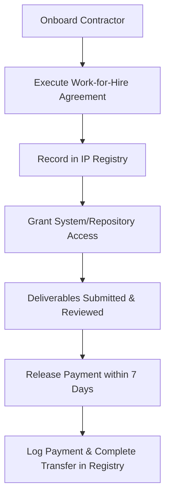

# Launch Compliance Checklist

*Operational checklist translating AICatchy legal and regulatory requirements into build-ready implementation specifications.*

---

## 1. User Interface & Interaction Specifications

### 1.1 Privacy Notice Banner
- **Trigger:** Display sticky banner at screen bottom on first visit for all users (both anonymous and authenticated).
- **Behavior:** Keep visible and readable without blocking core interactions until dismissed.
- **Bilingual Text:**
  - **Bahasa Indonesia (Default):** "Kami menggunakan data preferensi Anda untuk memberikan rekomendasi gaya terbaik. Dengan melanjutkan, Anda menyetujui [Kebijakan Privasi](05-privacy-policy.md) kami."
  - **English (Fallback):** "We use your preference data to provide the best style recommendations. By continuing, you agree to our [Privacy Policy](05-privacy-policy.md)."
- **Action:** A prominent "Setuju" / "Accept" button.
- **Implementation Hook:**
  - On click, store `privacy-accepted: true` and `privacy-accepted-date: <timestamp>` in browser `localStorage`.
  - Do not show the banner on subsequent page loads if `privacy-accepted` is true.

### 1.2 Analytics Opt-Out Toggle
- **Trigger:** Analytics tracking (page views, click tracking, usage telemetry) must be controllable by the user.
- **Location:** Place a toggle in the application footer or settings panel labeled:
  - **Bahasa Indonesia:** "Izinkan Analitik"
  - **English:** "Allow Analytics"
- **Behavior:**
  - Default status: Enabled by default *after* user accepts the privacy notice banner.
  - User can toggle it off at any time.
  - On toggle change, update `analytics-consent: true/false` in `localStorage`.
- **Implementation Hook:**
  - Analytics scripts (Google Analytics, Mixpanel, etc.) must check `localStorage.getItem('analytics-consent') !== 'false'` before initializing or dispatching event payloads.
  - If false, completely disable analytics SDK tracking or strip all personal metadata.

### 1.3 Affiliate Link Disclosures
- **Requirement:** User must see the disclosure before clicking any affiliate link.
- **Copy Hooks:**
  - **In-App Recommendation Screen:**
    - Place directly below the "3 Outfit Recommendations" section heading and before any shoppable merchant links.
    - **Bahasa Indonesia:** "Beberapa link adalah link afiliasi. AICatchy mendapat komisi tanpa biaya tambahan untukmu."
    - **English:** "Some links are affiliate links. AICatchy earns a commission at no extra cost to you."
    - *Styling:* Standard body font size (minimum 14px), full opacity, WCAG AA contrast (minimum 4.5:1 ratio).
  - **WhatsApp Concierge Recommendation Messages:**
    - Place in the first paragraph of the message payload, preceding the outfit cards.
    - **Text:** "Hi [Nama]! Berikut rekomendasi outfit dari AICatchy untuk acara [Occasion]. Beberapa link yang dishare adalah link afiliasi — AICatchy mendapat komisi tanpa biaya tambahan untukmu. Yuk, coba lihat!"
  - **Social Share Card (Client-side Canvas Image):**
    - Render text at the bottom footer of the generated canvas share image.
    - **Bahasa Indonesia:** "Link afiliasi — AICatchy bisa mendapat komisi."
    - **English:** "Affiliate link — AICatchy may earn commission."
    - *Styling:* Minimum 8pt size on a 600x900px canvas, contrasting background, highly visible.

### 1.4 Bilingual Requirements (Locale Engine)
- **Locale Detection:**
  ```javascript
  const userLocale = navigator.language || navigator.userLanguage;
  const currentLang = userLocale.startsWith('id') ? 'id' : 'en';
  ```
- **Control:** Provide a language switcher link (ID | EN) in the application footer that overrides browser auto-detection.
- **Content:** All legal interfaces (Privacy Banner, Disclosures, Settings, and Footer links to Privacy Policy and Terms of Use) must render strings matching the active locale.

---

## 2. Backend & Operations Specifications

### 2.1 Data Retention Enforcement (Purge Hooks)
Implement automated mechanisms to enforce the data retention policy.

| Data Category | Retention Limit | Backend Hook / Logic | Action |
|---|---|---|---|
| Pre-Login Session Data | Session Duration | Cleared when browser tab/session closes | Delete state memory |
| Clickstream / Click Logs | 30 Days | Database TTL index or cron job on `click_logs` table | Purge or aggregate and anonymize |
| System Error Logs | 7 Days | Log manager configuration | Purge/anonymize IP and identifiers |
| Analytics Event Logs | 90 Days | Cron job / retention policy in analytics engine | Purge or run anonymization scripts |
| Deleted Accounts | 30 Days SLA | User deletion trigger | Purge user records, style notes, and saved looks |

- **Anonymization Standard:** Raw records must be aggregated, and individual session identifiers, IP addresses, and user IDs must be permanently removed so they cannot be reconstructed.

### 2.2 Support & Security Communications
- **User Rights Requests:**
  - Setup routing rule for `support@aicatchy.com` to deliver directly to the operating founders.
  - Standard process: Fulfill UU PDP user data access, rectification, portability, and deletion requests within **7 calendar days** (exceeds the 30-day legal deadline).
- **Incident & Vulnerability Response:**
  - Establish `security@aicatchy.com` email alias.
  - Setup routing to target immediate alerts to all active engineers and operators.
  - Initial acknowledgement SLA: **24 hours**.
  - Ministerial (Ministry of Communication and Informatics) and data subject breach notification SLA: **72 hours** from discovery (per UU PDP Pasal 46).

### 2.3 Contractor & IP Onboarding Prework
To secure IP transfer before launch, operators must verify the onboarding steps for all contractors (stylists, developers, designers, and copywriters).



- **Onboarding Checklist for Operations:**
  1. **Contract Execution:** Contractor signs the standard Work-for-Hire (WFH) Agreement containing explicit IP assignment and waiver of moral rights.
  2. **Registry Log:** Add contractor entry to `.omp/context/ip-registry.md` with signed contract file location.
  3. **Access Provision:** Only grant repository or tool access *after* the WFH agreement is logged.
  4. **IP Release Gate:** Ensure that payment is finalized within 7 days of deliverable acceptance to ensure legal enforceability of the IP assignment.

---

## 3. Compliance Verification Test Cases

Developers and QA must verify the following scenarios before code is merged:

- **TC-01: First-Time User Privacy Banner**
  - *Setup:* Clear browser local storage.
  - *Action:* Load the homepage.
  - *Verify:* The bilingual privacy banner appears sticky at the bottom.
- **TC-02: Banner Acceptance Persistence**
  - *Action:* Click "Setuju / Accept" on the privacy banner.
  - *Verify:* Banner disappears; `privacy-accepted: true` is written to `localStorage`; refreshing the page does not show the banner.
- **TC-03: Analytics Opt-Out Enforcement**
  - *Action:* Set "Izinkan Analitik / Allow Analytics" toggle to false.
  - *Verify:* `analytics-consent: false` is written to `localStorage`. Trigger an event and verify no analytics payload is sent or stored.
- **TC-04: Affiliate Disclosure Visibility**
  - *Action:* Navigate to the outfit recommendation screen.
  - *Verify:* Affiliate disclosure is visible above the fold, rendered in standard size, readable contrast, and positioned immediately under the section header.
- **TC-05: Bilingual Fallback Logic**
  - *Action:* Set browser language to English (`en-US`).
  - *Verify:* Privacy banner, affiliate disclosure, and footer links automatically render in English.

---

## Changelog

| Date | Version | Change | Author |
|---|---|---|---|
| 2026-06-25 | 1.0 | Initial active version — build-ready compliance requirements | Steward |
