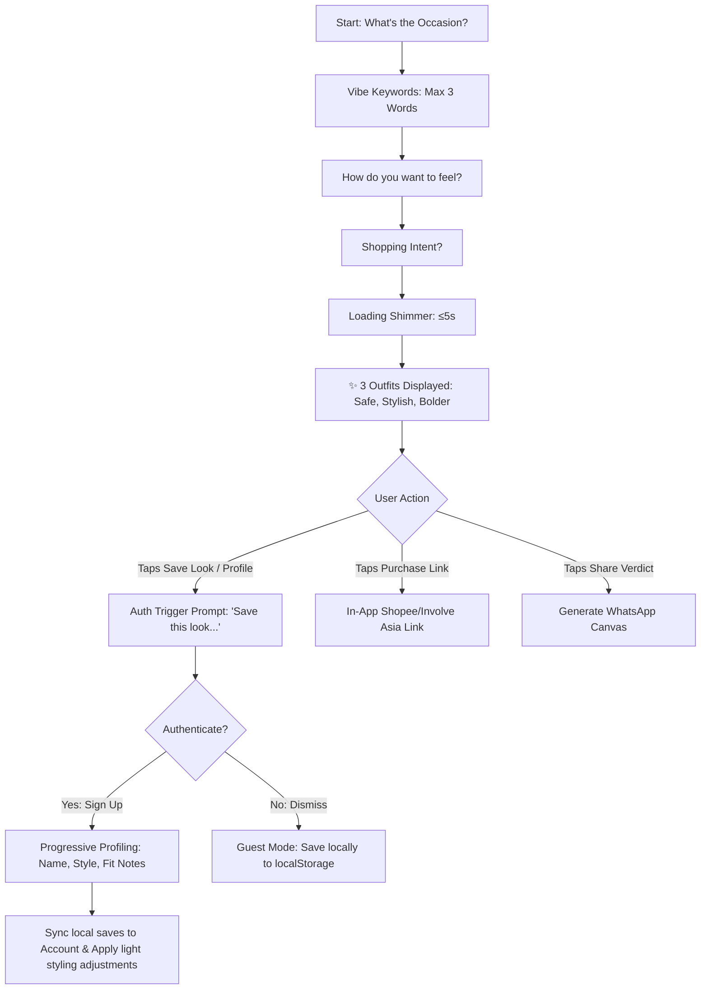

# UX Identity — Design Principles & Interaction Patterns

*Design principles and core interaction patterns for the AICatchy decision interface. This doc defines the Minimum Lovable Product (MLP) baseline for how the product looks, feels, and behaves — keeping decision velocity at the center of every interaction.*

---

## 1. Design Principles

### 1.1 Decision-First

Every pixel serves one goal: compressing the time from "what should I wear" to "I'll wear this."

| Apply | Avoid |
|-------|-------|
| Show outfits first, details second | Show filters, settings, or onboarding before results |
| Default selections where possible (Safe look) | Force the user to configure before they see anything |
| One primary action per screen (Generate, Buy, Save, Share) | Multiple competing CTAs with equal visual weight |

### 1.2 Value-First & Earned Auth

The product must deliver stylist-level confidence immediately without requiring sign-up, login, or initial profile building. Authentication is earned by providing value first.

- **Zero Up-front Friction:** First-time visitors and returning guests land directly on the "What's the occasion?" query flow. They receive outfit recommendations without an account.
- **Earned Auth Trigger:** The authentication prompt is gated behind value-generating actions. It is triggered when a user taps "Save Look" or attempts to customize long-term memory settings (style preferences, body-fit notes).
- **The Hook:** The core account acquisition call-to-action is: *"Save this look, and let's get to know each other."*
- **No-Account Fallback:** Users who dismiss the login prompt can continue in limited non-persistent mode. They can generate outfits, but their saves are restricted to client-side `localStorage` (pre-login saves) with no cross-device sync, and they receive no profile-based personalization.
- **Pre-Login Save Claiming:** Outfits saved to `localStorage` during guest sessions are preserved and automatically uploaded/merged into the user's database profile upon successful signup/login.

### 1.3 Personal-Stylist Experience

AICatchy is a personal stylist that helps people decide what to wear for real-life occasions, combining stylist-level confidence with product-level speed.

- **Occasion as Unit of Value:** Every recommendation is a complete answer to "what do I wear for this one thing." Results are organized and displayed by occasion.
- **Explainable Curation:** Recommendations are backed by human-curated styling formulas. Trust comes from explaining *why* an outfit works (e.g., color compatibility, silhouette appropriateness) via a 1–2 sentence styling rationale, avoiding robotic checklists.
- **"Magazine-Worthy" Visuals:** The presentation feels polished, intentional, and elevated, yet represents outfits that are highly wearable and realistic for the user's occasion.

### 1.4 Light Progressive Profiling

Onboarding is not a wall; it is a gradual, optional conversation. Immediate post-signup onboarding is restricted to a single, low-friction screen.

- **Minimum Post-Signup Profile:**
  - **Name:** To personalize greetings and styling rationales.
  - **Style-Preference Starter (Optional):** Light checkable preferences (e.g., Hijab-friendly, Casual, Minimalist, Colorful) to guide formula selection.
  - **Body-Fit Note Starter (Optional):** Free-text styling guidelines focused strictly on silhouette and fit drape (e.g., "prefer oversized tops", "needs petite proportions").
- **Privacy & Styling Boundary:** Body data is strictly used for fit/silhouette guidance, never for beauty or identity inference. Personalization is visible but light, keeping styling curation at the center.
- **Wardrobe-Awareness Boundary:** Recommendations aim to be wardrobe-compatible (pieces that pair easily with common closet staples), not true wardrobe modeling (no item cataloging or virtual closet uploads).

---

## 2. Core User Flow

### 2.1 Flow Rules

- **Zero Barrier to Entry:** The primary flow never requires credentials or profile details before displaying the first set of recommendations.
- **Context Preservation:** Going back preserves entered inputs in client-side state. Adjusting an input re-runs the recommendation without repeating unrelated steps.
- **One-Screen Progressive Profiling:** Post-signup profiling is restricted to a single screen with optional inputs. Skipping profiling takes the user immediately back to their saved result.
- **Save Syncing:** Tapping "Save" under guest mode saves to `localStorage`. Tapping it post-login saves directly to the account database, triggering a remote sync of any existing `localStorage` looks.

---

## 3. Interaction Patterns

### 3.1 Chip Selection

Chips are the primary input mechanism to reduce typing friction.

| Rule | Detail |
|------|--------|
| Single-select chips | Occasion, expression, intent — one active at a time. |
| Tap target | Minimum 44×44px touch area (mobile accessibility standard). |
| Active state | Filled background (`#6C5CE7`) + checkmark + subtle scale animation (105%). |
| Inactive state | Outlined border, transparent background. |
| Free text override | "Other" chip displays an inline text input below the row instead of navigating away. |

### 3.2 Free Text Inputs

Character-bounded inputs for vibe keywords and custom occasions.

- **Vibe Keywords:** Single input field. Separates inputs by spaces; character-bounded word counter displays "N/3 kata." Input blocks once 3 words are typed, showing a subtle helper message: "Maksimal 3 kata."
- **Custom Occasion:** Appears only when "Other" chip is tapped. 200-character limit. Placeholder: "Tulis acara kamu... (contoh: hangout cafe, kondangan sahabat)."

### 3.3 Swipe Between Outfits (Mobile)

Mobile viewports use a horizontal swipeable carousel for the three outfits (Safe, Stylish, Bolder).

| Rule | Detail |
|------|--------|
| Visible peek | 15–20% of adjacent cards are visible on margins to signal horizontal swipability. |
| Snap behavior | Cards snap cleanly to center on release. No partial positions. |
| Dot indicator | Three dots below the carousel, filled for the active card. |
| Label visible | Naming ("Safe", "Stylish", "Bolder") is permanently visible above each card. |
| Gesture hint | Subtle shimmer on the edge of card 1 on first load to signal swipe gesture. |

### 3.4 Desktop Fallback

Desktop is a secondary surface. The product is optimized for mobile web; desktop viewports show the same mobile carousel layout within a centered ≤430px container.

- **Steering:** A minimal banner suggests scanning a QR or visiting on mobile for the best experience.
- **Layout:** ≥768px viewports display the mobile carousel constrained to ≤430px, centered. No three-column grid.
- **Interaction:** Swipe works via click-drag or arrow nav. Hover states are omitted — the touch-based interaction model is the primary target.

### 3.5 Earned Auth & Save Interaction

Gating personalization and persistence behind value delivery.

- **The Save Prompt:**
  - Tapping "Save" when unauthenticated displays a slide-up sheet (mobile) or modal (desktop):
    - Headline: *"Save this look, and let's get to know each other."*
    - Value proposition: "Buat akun gratis untuk simpan look selamanya, akses riwayat occasion, dan personalisasi fitting stylist kamu."
    - Options: "Sign Up / Log In" (Primary CTA) or "Nanti saja, simpan di HP ini" (Secondary CTA).
- **Auth Success & Sync:**
  - Upon logging in, any outfits stored in guest `localStorage` are transmitted to the user's account database.
  - The UI updates the heart icon to an active/saved state and throws a success toast: "Look berhasil disimpan ke akun kamu!"
- **No-Account Fallback (Guest Save):**
  - Selecting "Nanti saja" saves the look to the browser's local `localStorage` and closes the prompt.
  - Shows toast: "Tersimpan di perangkat ini (belum sinkron ke akun)."
  - Limit: A persistent warning banner or small icon indicator on the Saved Looks panel reminds guests: "Look disimpan di perangkat ini. Buat akun untuk sinkronisasi."

### 3.6 Share Verdict

Generates a shareable card to seek outfit validation from friends.

- **WhatsApp Share:** Share icon opens the WhatsApp client with pre-filled message text: "Bantu pilih outfit dong! Menurutmu cocok yang mana untuk [Occasion]? [Affiliate Link]".
- **Canvas Generation:** The app renders a client-side canvas card (outfit image collage + occasion + rating options) that can be saved or copied directly to clipboard for sharing.

### 3.7 Progressive Profiling & Fit Capture

Minimalist profiling immediately after signup to initialize the personal stylist experience.

- **Screen Layout:** Single-page step with a clean, friendly header: "Hi [Name/Sobat AICatchy], yuk atur preferensi gayamu!"
- **Form Fields:**
  1. **Style Preference Starter:** Multiselect chips/checkboxes representing style directions:
     - `[Minimalist]` `[Hijab-friendly]` `[Sporty]` `[Classic]` `[Edgy]`
  2. **Body-Fit Note Starter:** Free-text input field (max 150 characters) to capture fit constraints:
     - Placeholder: "Contoh: lebih suka atasan oversized, hindari celana terlalu ketat, butuh lengan panjang."
     - Critical standard: Must clearly state underneath the input: *"Informasi ini hanya digunakan untuk menyaring potongan siluet pakaian, bukan untuk penilaian fisik."*
- **Skippability:** A "Nanti saja / Lewati" text button is always visible. Completing or skipping the profile routes the user back to their active outfit results.

### 3.8 Swap Item & Budget Adjustment (Deferred / P1)

These interactive capabilities are deferred post-launch to maintain a lightweight core.

- **Swap Item (P1):** Slide-up panel displaying 2-3 alternative clothing items matching the outfit formula context.
- **Budget Adjustment (P1):** Price slider or preset filters to adjust outfit item results based on cost brackets.

---

## 4. Visual Language

### 4.1 Color Palette

| Token | Usage | Hex |
|-------|-------|-----|
| Primary | CTAs, active chips, key accents | `#6C5CE7` (purple) |
| Primary hover | Interactive states | `#5A4BD1` |
| Background | Page background | `#FAFAFA` |
| Surface | Card backgrounds, input areas | `#FFFFFF` |
| Text primary | Headlines, body | `#1A1A2E` |
| Text secondary | Labels, descriptions | `#6B7280` |
| Success | Saved, confirmed | `#10B981` |
| Warning | Alert indicators | `#F59E0B` |
| Error | Validation errors | `#EF4444` |

*Purple connotes creativity, confidence, and intelligent styling, differentiating the brand from standard Indonesian e-commerce platforms (Shopee orange, Tokopedia green).*

### 4.2 Typography

- **Font Family:** System font stack (Inter / SF Pro / Roboto). No custom font asset loading in V1.
- **Scalability:** Layout does not break at 200% browser zoom; text remains highly readable.

### 4.3 Imagery & Collages

- **Product Images:** Sourced from Shopee or Involve Asia merchant feeds.
- **Collage Layout:** Card hero contains a styled collage representing the complete outfit system (e.g. Hero outerwear/top + overlaying bottom & footwear/accessories).

---

## 5. Error & Fallback States

### 5.1 Account & Sync Failures

| Scenario | User sees | Action |
|----------|-----------|--------|
| Syncing fails | Toast: "Gagal menyimpan ke akun. Tenang, look masih tersimpan di perangkat ini." | Retry sync automatically on network reconnection. |
| Profile update timeout | Toast: "Gagal menyimpan preferensi. Kamu bisa mengaturnya nanti di menu profil." | Allow skipping/exiting profiling screen immediately. |

### 5.2 Input Validation

- **Custom Occasion Gibberish:** If input fails basic validation (e.g., repeating characters, pure gibberish), inline error reads: "Kami kurang mengenali acara ini. Coba tulis lebih spesifik (contoh: rapat kantor, nongkrong santai)."
- **Missing Required Input:** Gated at "Generate" tap with inline highlighting of the unfilled input field.

---

## 6. Accessibility & Compliance (UU PDP)

- **Touch Targets:** All interactive elements maintain a minimum target of 44×44px.
- **Silhouettes & Privacy Compliance:** Personal fit descriptions are stored securely in the user profile database, are completely editable or erasable by the user, and are strictly used to filter catalog tags (sleeve length, length, fit type). No measurements or visual body scans are captured, ensuring high compliance and low trust barriers.

---

## 7. Platform Constraints (Mobile-First)

- **In-App Browser Sandbox:** Affiliate links must open cleanly in in-app browsers (e.g. Instagram/TikTok browser sandboxes) without breaking the session state.
- **LocalStorage Durability:** Local storage is utilized as the local backup for saved looks. The UI must elegantly handle scenarios where local storage is cleared by iOS/Android browser policy by prompting the guest user periodically to create a free account to ensure their looks are saved permanently.
- **Desktop Is Secondary:** Desktop viewports are a fallback surface. The mobile web experience is the target. Desktop users see the mobile carousel within a constrained container and are gently steered to switch to a mobile device. No desktop-specific layout or interactions are built beyond basic functional parity.

---

## Changelog

| Date | Version | Change | Author |
|------|---------|--------|--------|
| 2026-06-25 | 1.2 | Rewrote UX identity to value-first earned auth model. Replaced zero-onboarding with post-result auth logic, progressive profiling, fit-note capture, local-to-remote save sync, and no-account fallback. | Craftsman |
| 2026-06-25 | 1.1 | Aligned UX Identity with MLP baseline (localStorage Save/Share only, deferred Swap/Budget to P1, enforced no-backend-state). | Craftsman |
| 2026-06-24 | 1.0 | Initial active version | Craftsman |
