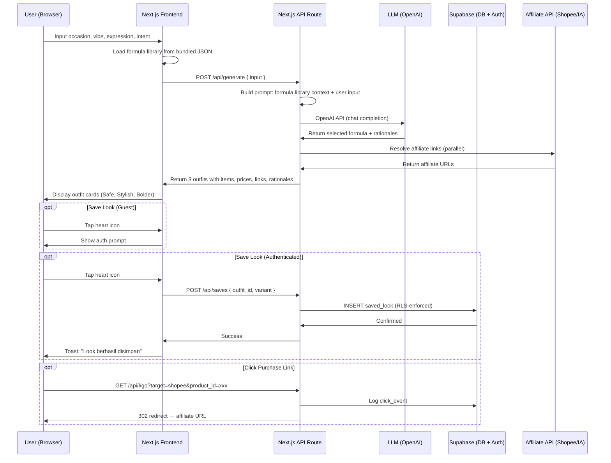

# Tech Stack Architecture Decision Record — MLP Baseline

*Decisions that lock the AICatchy MLP stack for implementation. This ADR captures the single executable build baseline for the MLP. It contains context, chosen options, rejected alternatives, and revisit triggers. Engineering can start building from this document without re-litigating core stack choices.*

---

## 1. Context

### 1.1 What We Are Building

AICatchy MLP: a mobile-first web app that takes occasion + vibe + expression + shopping intent input and returns 3 complete outfit recommendations (Safe, Stylish, Bolder) with affiliate purchase links. Users earn auth after the first recommendation by saving a look. Authenticated users get server-side persistence (style memory, saved looks, body-fit notes). Guests use localStorage-only saves that can be claimed on signup.

### 1.2 Key Constraints

| Constraint | Detail |
|---|---|
| Team size | 1–2 engineers, seed-stage startup |
| Target users | 20–100 soft-launch users, Indonesia market |
| Effort budget | Build in weeks, not months — MLP must ship |
| Performance | P95 time-to-first-outfit <5s |
| Persistence | Hybrid: guest localStorage + server-side DB for authenticated users |
| Formula library | Static JSON (~100–300 formulas), bundled with app |
| Affiliates | Shopee Affiliate API + Involve Asia merchant deep links |
| LLM scope | Routing/selection/presentation only — not autonomous generation |
| Infrastructure cost | Near-zero during MLP; must not require paid infra before validation |
| Auth | Earned auth: deferred post-recommendation, triggered by save action |
| Data privacy | UU PDP (Law No. 27/2022) compliance required; no unnecessary data collection |

### 1.3 Document Dependencies

- **L2-03**: UX identity — design principles, interaction patterns, design tokens
- **L3-01**: Product spec — feature list, user flows, acceptance criteria
- **L3-02**: Formula library — data model, occasion taxonomy, item schema
- **L3-03**: Affiliate API — Shopee + Involve Asia integration spec
- **L0-02**: Affiliate disclosure — legal compliance for affiliate links
- **L1-01**: Strategy memo — locked thesis and product direction

---

## 2. Stack Decisions

### 2.1 Executive Summary

| Layer | Decision | Rationale |
|---|---|---|
| **Frontend framework** | Next.js 14+ (React, App Router) | Single project for frontend + API routes; largest ecosystem; SSR for performance |
| **Language** | TypeScript (strict mode) | Type safety across frontend + backend boundaries; standard for Next.js |
| **Styling** | Tailwind CSS v3+ | Design-token alignment with L2-03 palette; utility-first matches small-team velocity |
| **Backend runtime** | Next.js API Routes + Server Actions | Co-located with frontend; covers LLM proxy, auth, affiliate resolution, click tracking |
| **Database** | Supabase (PostgreSQL) | Built-in auth, RLS, generous free tier (500MB DB, 50K MAU) |
| **Authentication** | Supabase Auth | Zero-implement auth with email/password + magic link; RLS for data isolation |
| **LLM provider** | OpenAI GPT-4o-mini via server-side API | Best cost/quality for Indonesian text routing; $0.15/1M input tokens |
| **Hosting** | Vercel (Next.js) + Supabase Cloud | Zero-ops deploy; generous free tier through MLP phase |
| **Formula store** | Bundled JSON file | No DB query needed; versioned with deploys; fast client-side load |
| **Analytics** | PostHog (self-hosted or cloud) | Open-source product analytics; event tracking; generous free tier |

### 2.2 Frontend Framework — Next.js 14+

**Decision:** Next.js 14+ with App Router, React Server Components where beneficial, TypeScript strict mode.

**Rationale:**
- Single project serves frontend and thin API backend — reduces deployment surfaces from 2 to 1.
- App Router co-locates API routes alongside pages, matching the small-team workflow.
- SSR/SSG provides fast initial loads without a separate CDM optimization project.
- Largest talent pool and ecosystem in Indonesia (React is the dominant frontend framework).
- Vercel hosting is the natural deploy target — zero-ops, free tier covers MLP traffic.
- Server Actions simplify form handling for the input flow (occasion, vibe, expression, intent).

**Rejected alternatives:**
- *Vite + React (separate backend)*: Requires separate backend project and deploy pipeline. Adds coordination overhead for a 1–2 person team.
- *SvelteKit*: Smaller ecosystem and talent pool. Less community support for affiliate/LLM integrations.
- *HTMX + Jinja (Python)*: Mismatch for the dynamic, state-heavy outfit carousel UI. Weak client-side state management.

**Revisit trigger:** Team grows beyond 3 engineers, or performance profiling shows Next.js SSR overhead dominating the <5s budget. At that point, evaluate a dedicated backend service (Hono/Fastify) with a decoupled SPA.

### 2.3 Styling — Tailwind CSS

**Decision:** Tailwind CSS v3+ with a project-level `tailwind.config.js` that encodes the AICatchy design tokens from L2-03.

**Rationale:**
- Direct mapping from L2-03 color palette (primary `#6C5CE7`, background `#FAFAFA`, surface `#FFFFFF`, text `#1A1A2E`) to Tailwind theme tokens.
- Utility-first approach matches ponytail philosophy: style in markup, no separate CSS files for simple components.
- PurgeCSS built-in keeps production bundle small.
- v3+ JIT mode means zero initial CSS generation cost.

**Revisit trigger:** Extracting a formal design system or component library. At that point, consider moving to `shadcn/ui` (headless Radix primitives themed via Tailwind) to reduce repetitive markup.

### 2.4 Backend Runtime — Next.js API Routes

**Decision:** All server-side logic lives in Next.js API routes and Server Actions, co-located under `app/api/` and `app/_actions/`.

**Coverage:**
- `POST /api/generate` — Receives user input, selects formula via LLM, resolves affiliate links, returns 3 outfits.
- `POST /api/auth/*` — Signup, login, session management (via Supabase Auth server client).
- `GET /api/l/go` — Click tracking redirect endpoint.
- `POST /api/saves` — CRUD for saved looks (authenticated).
- `POST /api/profile` — Style preferences and body-fit notes (authenticated).
- Server Actions for form mutations (save look, update profile).

**Rationale:**
- Eliminates a second backend deploy target — one `vercel deploy` ships everything.
- API routes share TypeScript types with the frontend (formula types, user types).
- Request duration limits on Vercel (10s on Hobby, 60s on Pro) are acceptable: LLM calls target <5s, affiliate API calls <2s.
- Edge functions are not needed — all API routes use the Node.js runtime for Supabase SDK and OpenAI SDK compatibility.

**Revisit trigger:** (a) LLM processing exceeds Vercel's 60s function timeout, requiring a dedicated worker. (b) Background job needs (e.g., scheduled warm-cache for top-50 formulas). At that point, add a simple worker service (same codebase, deployed to Railway or similar).

### 2.5 Database — Supabase (PostgreSQL)

**Decision:** Supabase PostgreSQL for authenticated user data. Schema managed via Supabase migrations.

**Data stored on server:**
- `users` — Auth-managed; extended with display_name, style_preferences (JSONB), body_fit_notes (JSONB).
- `saved_looks` — Outfit saves per user: formula_id, variant, item snapshots, LLM rationale, created_at.
- `click_events` — Anonymous click tracking for affiliate link performance (IP anonymized after 24h).
- `generation_logs` — Occasion queries (anonymized) for formula library gap analysis.

**Data NOT stored on server (MLP):**
- Formula library (JSON, bundled with app)
- Pre-auth guest saves (localStorage)
- Raw IP or device fingerprints beyond 24h

**Rationale:**
- Free tier (500MB DB, 2GB storage, 50K MAU, 5GB bandwidth) covers MLP comfortably.
- Row-Level Security (RLS) enforces per-user data isolation without application-layer checks — critical for UU PDP compliance.
- Supabase Auth is built in — no separate auth database or service.
- PostgreSQL is the right relational DB for this use case: structured data with JSONB flexibility for semi-structured profiles.
- Supabase JS SDK provides real-time subscriptions if needed for future features (live share, collaborative styling).

**Rejected alternatives:**
- *Neon (serverless PG)*: Excellent product, but requires separate auth service (Supabase Auth, Clerk, Auth0). More integration work for a 1–2 person team.
- *SQLite via Turso*: Edge-hosted SQLite with HTTP access. Lacks built-in auth and RLS. Would need custom auth middleware and per-user isolation logic.
- *Firebase Firestore*: Document DB — schema-less design invites data inconsistency. Not relational enough for the structured saved_looks + users data model. Vendor lock-in concern.
- *MongoDB Atlas*: Overkill for V1 schema. Requires separate auth provider. Higher operational overhead.

**Revisit trigger:** User base exceeds Supabase free tier limits, or data model grows beyond simple relational + JSONB patterns. At that point, migrate to a dedicated PostgreSQL instance (RDS, Cloud SQL) with a standalone auth provider.

### 2.6 Authentication — Supabase Auth

**Decision:** Supabase Auth with email/password (first) and magic link (if email deliverability is reliable).

**Flow:**
1. Guest generates outfit — no auth barrier.
2. User taps "Save look" or "Styling Memory" — auth prompt slides up.
3. User signs up with email + password or magic link.
4. Post-signup: optional profile setup (name, style preferences, body-fit notes).
5. localStorage guest saves are claimed and merged into the user's Supabase profile.
6. Subsequent sessions: auto-restore session via Supabase client SDK.

**Rationale:**
- Zero lines of auth infrastructure code — Supabase provides the entire flow.
- RLS policies on `saved_looks` and `profiles` tables ensure user data isolation without custom middleware.
- Session management is built into the Supabase JS client (cookie-based, auto-refresh).
- Future social login extensions (Google, Apple) are one config change away.

**Revisit trigger:** Need for OAuth-only flows, custom JWT claims, or multi-tenant auth. At that point, migrate to Clerk or Auth0.

### 2.7 AI Provider Abstraction (LLM Integration)

**Decision:** Abstract the AI provider behind a minimal `AIProvider` interface. The MLP ships with an `OpenAIV1` implementation using OpenAI GPT-4o-mini. The interface provides a clear seam for future capabilities (e.g., image analysis/Instagram vision) without tightly coupling the Next.js API routes to a specific vendor SDK.

**Usage scope:**
- Formula selection: match user input (occasion + vibe + expression) to the closest formula in the JSON library.
- Styling rationale generation: produce natural-language rationale for each outfit.
- Fallback matching: if no formula matches, generate a reasonable fallback.

**Provider Interface Seam:**
```typescript
interface AIProvider {
  routeFormula(input: RoutingInput): Promise<RoutingOutput>;
  generateRationale(context: RationaleContext): Promise<RationaleOutput>;
}
// V1 Implementation: class OpenAIV1 implements AIProvider { ... }
```

**Rationale for OpenAI GPT-4o-mini:**
- Cost leader among capable models: $0.15/1M input tokens. A typical outfit generation session uses ~2K input tokens. Cost per session: ~$0.0006 — viable at MLP scale.
- Fast inference: typical response time <2s for the routing task.
- OpenAI SDK is mature and works seamlessly in Next.js server environment.
- The interface abstraction (the single architectural seam retained from the L3-11 deferred plan) encapsulates the SDK so the rest of the app doesn't know it's OpenAI.

**Prompt management:** System prompt is version-controlled in the codebase. No prompt is constructed client-side — the API key stays server-side.

**Revisit trigger:** (a) Monthly LLM cost exceeds $100. (b) Latency consistently exceeds 3s. (c) Adding image-based input requirements.

### 2.8 Hosting — Vercel + Supabase Cloud

**Decision:** Vercel (Hobby/Pro tier) for Next.js application; Supabase Cloud (Free tier) for database and auth.

| Resource | Current (MLP) | Upgrade path |
|---|---|---|
| Frontend + API | Vercel Hobby (free) | → Vercel Pro ($20/mo) when bandwidth exceeds 100GB/mo |
| Database + Auth | Supabase Free (500MB DB, 50K MAU) | → Supabase Pro ($25/mo) when exceeding free tier limits |
| Custom domain | Vercel Hobby supports custom domains | — |
| CDN | Vercel Edge Network (global, free) | — |
| LLM API | OpenAI pay-as-you-go | — |

**Rationale:**
- Vercel + Next.js is the canonical deploy combination — zero configuration.
- Supabase Free tier is genuinely usable for production at MLP scale.
- Both services are Indonesian-latency-friendly (Vercel has Jakarta edge nodes; Supabase Singapore region is <30ms from Jakarta).
- Total infrastructure cost during MLP: ~$0 (beyond OpenAI API consumption, estimated <$10/mo at 500 sessions).

**Revisit trigger:** (a) Monthly infra cost exceeds $100. (b) Vercel function timeout (10s/60s) consistently hit. (c) Need for dedicated staging/preview environments beyond what Vercel provides.

### 2.9 Analytics — PostHog

**Decision:** PostHog (self-hosted on Railway or cloud free tier) for product analytics.

**Events tracked (MLP):**
- `generation_started`, `generation_completed` — with occasion, vibe length, success/failure.
- `outfit_saved` — with variant (safe/stylish/bolder), auth status.
- `link_clicked` — with platform (shopee/involveasia), variant.
- `share_initiated` — share method.
- `auth_prompt_shown`, `auth_completed`, `auth_dismissed`.

**Rationale:**
- Open-source, self-hostable — no data sovereignty concerns (relevant for UU PDP).
- Generous cloud free tier (1M events/mo) covers MLP deeply.
- Funnel analysis, retention charts, and session recording all in one product — no need to stitch Amplitude + Hotjar.
- Event API is simple; can be called from both client and server.

**Revisit trigger:** Event volume exceeds free tier, or need for enterprise-grade data governance. Migrate to self-hosted PostHog or switch to Amplitude.

---

## 3. Logical Module Organization (from L3-11)

Even though we are building a single Next.js monolith (and not a pnpm workspaces monorepo), the codebase will follow a strict logical separation matching the L3-11 domains:
- `web/`: User-facing React components (client/server).
- `api/`: API route handlers and server actions.
- `domain/`: Pure business logic, AI provider interfaces, and shared Zod schemas.

## 4. Architecture Flow



---

## 5. Data Model Summary

### 5.1 Supabase Tables (Server)

```sql
-- Extended user profile
create table profiles (
  id uuid references auth.users primary key,
  display_name text not null,
  style_preferences jsonb default '[]',   -- ["minimalist", "hijab-friendly"]
  body_fit_notes jsonb default '{}',       -- {"silhouette": "prefer oversized", ...}
  created_at timestamptz default now(),
  updated_at timestamptz default now()
);
```

---

## Changelog

| Date | Version | Changes | Author |
|------|---------|---------|--------|
| 2026-06-25 | 0.1 | Initial draft — MLP tech stack ADR with 9 stack decisions | Architect |
| 2026-06-25 | 1.0 | Activated baseline for MLP build | Architect |
